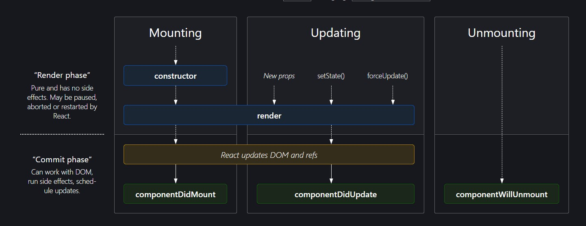

## Lifecycle Methods
<a href="https://projects.wojtekmaj.pl/react-lifecycle-methods-diagram/">Lifecycle Methods Diagram</a>

#### Mounting
The process of creating instances and DOM nodes corresponding to React components, and inserting them into the DOM, is called mounting. 
The <a href="https://reactjs.org/docs/react-component.html#componentdidmount">componentDidMount()</a> lifecycle method gets fired after the component is mounted.

#### Updating
A component gets updated when:
* its parent element gets rerendered
* a new state/props value is provided to the component
* the component is force updated using <a href="https://reactjs.org/docs/react-component.html#forceupdate">forceUpdate()</a> method

The <a href="https://reactjs.org/docs/react-component.html#componentdidupdate">componentDidUpdate()</a> lifecycle method gets fired after the component is updated. 

It is good practice to use the <a href="https://reactjs.org/docs/react-component.html#shouldcomponentupdate">shouldComponentUpdate</a> lifecycle method which returns a boolean value to specify whether the component should be rerendered. 
For example, the component need not be rerendered when the parent element gets updated, if the props passed to the component remains the same.